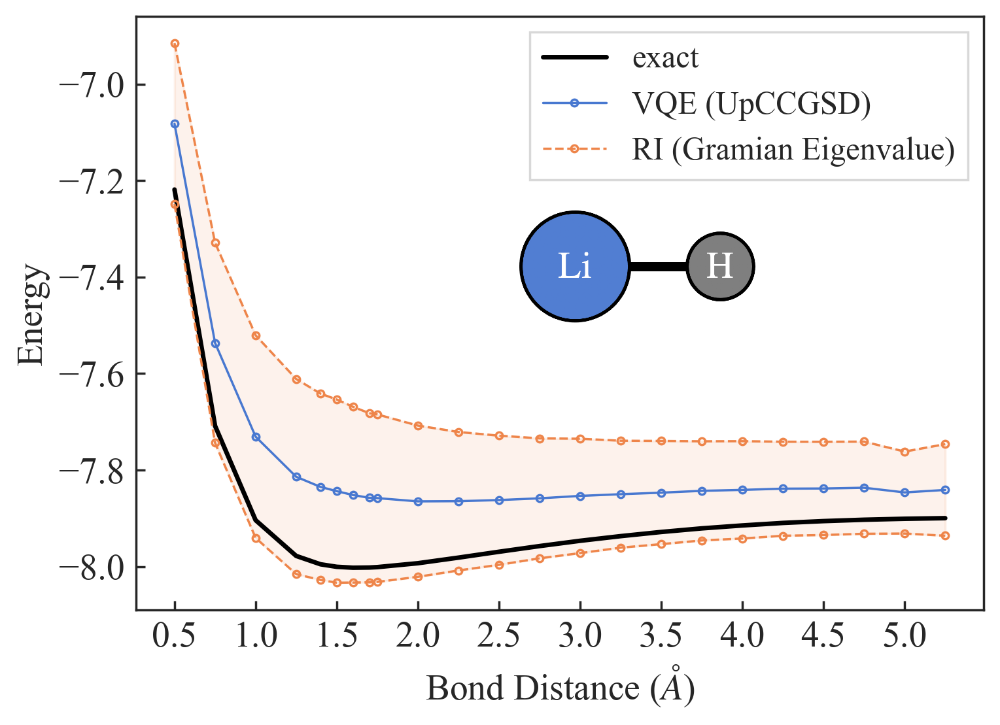

# Toward Reliability in the NISQ Era: Robust Interval Guarantee for Quantum Measurements on Approximate States

This repo contains the code for the paper _"Toward Reliability in the NISQ Era:  Robust Interval Guarantee for Quantum
Measurements on Approximate States"_ [1]. A tutorial the shows how to use the implementation of robustness intervals in
Tequila is available [here](XXXXXX).

<p align="center">
  
</p>

## Requirements

* Tequila together with psi4 as chemistry backend (see
  the [Tequila repository](https://github.com/aspuru-guzik-group/tequila) for installation).
* Quantum backends: [Qiskit](https://github.com/qiskit/qiskit) (< 0.25) for simulations with noise
  and [Qulacs](https://github.com/qulacs/qulacs) for noiseless simulations.

## Usage

To compute robustness intervals for eigenvalues of a given Hamiltonian, the first step is to run a variational quantum
eigensolver. The second step is to compute required statistics, namely expectation values and fidelities and, if
necessary, variances.

For example, to use a noisy VQE with an SPA Ansatz [2] to estimate bond dissociation curves for $H_2(2, 4)$ in a
basis-set free approach [3, 4], we need to run the following command

```
python run_vqe.py --molecule h2 --ansatz spa --noise bitflip-depol --error-rate 0.01 --samples 8192 --backend qiskit
```

This runs VQE and saves the results in the subdir `./results/dir/to/results`. The second step is to compute the
statistics. For example, to get the Gramian eigenvalue bound, we run the command

```
python compute_stats.py --results-dir ./results/dir/to/results --which hamiltonian
```

Finally, to compute the Gramian eigenvalue intervals, we run the command

```
python compute_interval.py --results-dir ./results/dir/to/results --method gramian-eigval
```

For the above example, this results in the following table:

| r | exact | fidelity | vqe_energy | lower_bound | upper_bound |
|---|---|---|---|---|---|
| 0.50 | -1.077562481 | 0.958205382 | -0.988021299 |  -1.083851669 |  -0.892573143 |
| 0.60 | -1.131093394 | 0.957995880 | -1.049706365 |  -1.134667839 |  -0.964082683 |
| 0.70 | -1.149766772 | 0.958045453 | -1.078714705 |  -1.154566071 |  -1.003039667 |
| 0.75 | -1.151648186 | 0.957997992 | -1.084870980 |  -1.156489296 |  -1.013617719 |
| 0.80 | -1.150463131 | 0.956361844 | -1.083803309 |  -1.154374306 |  -1.012676374 |
| 0.90 | -1.141818498 | 0.957287300 | -1.082813293 |  -1.145940205 |  -1.019863177 |
| 1.00 | -1.128477954 | 0.956343543 | -1.074174701 |  -1.132620953 |  -1.015699398 |
| 1.25 | -1.089243435 | 0.955575508 | -1.041665818 |  -1.092590918 |  -0.991141821 |
| 1.50 | -1.053578279 | 0.953605150 | -1.012057922 |  -1.057875400 |  -0.966444444 |
| 1.75 | -1.026226767 | 0.947645608 | -0.986626289 |  -1.031472964 |  -0.942610056 |
| 2.00 | -1.007246702 | 0.940898351 | -0.969707699 |  -1.014640383 |  -0.924539724 |
| 2.25 | -0.994987898 | 0.938526329 | -0.958604338 |  -1.001223562 |  -0.915913894 |
| 2.50 | -0.987402706 | 0.936911723 | -0.951663413 |  -0.993183626 |  -0.910199765 |
| 2.75 | -0.983085755 | 0.927166048 | -0.945083506 |  -0.989858075 |  -0.900383804 |

The script `./analyze/make_figure_gramian_eigenvalue_bound.py` can be used to generate the corresponding figure:

<p align="center">
  
</p>

## References

[1] Maurice Weber, Abhinav Anand, Alba Cervera-Lierta, Jakob S. Kottmann, Thi Ha Kyaw, Bo Li, Alán Aspuru-Guzik, Ce
Zhang and Zhikuan Zhao. _"Toward Reliability in the NISQ Era:  Robust Interval Guarantee for Quantum Measurements on
Approximate States"_, arXiv:2110:XXXXXX (2021).

[2] Jakob S. Kottmann, Alán Aspuru-Guzik. _"Optimized Low-Depth Quantum Circuits for Molecular Electronic Structure
using a Separable Pair Approximation"_, arXiv:2105.03836 (2021).

[3] Jakob S. Kottmann, Philipp Schleich, Teresa Tamayo-Mendoza, and Alán Aspuru-Guzik. _"Reducing Qubit Requirements
while Maintaining Numerical Precision for the Variational Quantum Eigensolver: A Basis-Set-Free Approach"_, J. Phys.
Chem. Lett.12, 663 (2021).

[4] Jakob S. Kottmann, Florian A. Bischoff, and Edward F. Valeev. _"Direct determination of optimal pair-natural
orbitals in a real-space representation: The second-order Moller–Plesset energy"_, J. Chem. Phys. 152, 074105 (2020).
